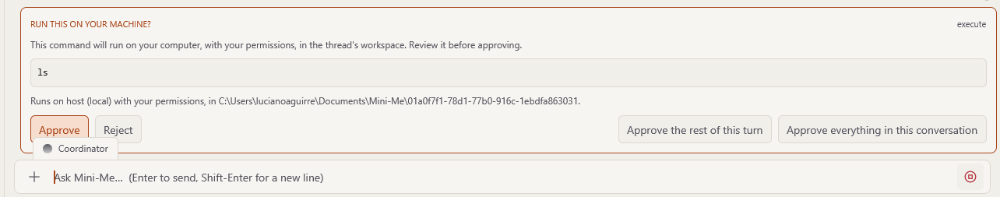

# Aprobaciones y créditos

Mini-Me siempre **pregunta antes** de hacer dos tipos de cosas:

1. **Ejecutar un programa en tu computadora** (por ejemplo, un pequeño script que hace un
   gráfico).
2. **Gastar créditos** en un servicio de pago.

Así mantienes el control. No pasa nada hasta que dices que sí.

## "Run this on your machine?"

Cuando Mini-Me quiere ejecutar algo en tu computadora, la conversación se pausa y aparece un
cuadro con el título **RUN THIS ON YOUR MACHINE?** (¿ejecutar esto en tu equipo?). Muestra
exactamente qué se va a ejecutar.

Puedes elegir:

| Botón | Qué significa |
|---|---|
| **Approve** | Ejecuta solo esto. Vuelve a preguntarme la próxima vez. |
| **Reject** | No lo ejecutes. Mini-Me intentará otra forma o te dirá que no puede continuar. |
| **Approve the rest of this turn** | Ejecuta esto y todo lo demás que haga falta **solo para esta pregunta**. |
| **Approve everything in this conversation** | No vuelvas a preguntar **en esta conversación** (hasta que cierres la aplicación). |

::: {.callout-tip}
No pasa nada si no sabes leer código. Los comandos suelen ser pasos de análisis, como leer tu
archivo o dibujar un gráfico. Elegir **Approve the rest of this turn** es un buen equilibrio
entre seguridad y no recibir preguntas con demasiada frecuencia.
:::

Si elegiste *Approve everything*, la barra inferior muestra **approving everything — click to
stop**. Haz clic en ella para volver a recibir la pregunta cada vez.

Puedes desactivar estas preguntas por completo en **Settings → Backend → Ask before every
command**, pero te recomendamos dejarlas activadas.

## AutoDiscovery y créditos

**AutoDiscovery** explora un conjunto de datos por su cuenta haciendo muchos experimentos
pequeños. Usa un servicio de pago en el que **cada experimento cuesta un crédito**, así que
siempre se detiene primero y pregunta **Start this discovery run?** (¿iniciar esta
exploración?).

1. Lee la descripción de lo que va a explorar.
2. En **EXPERIMENTS TO RUN**, elige cuántos experimentos quieres (menos = más barato).
3. Revisa cuántos **créditos te quedan**. Si dice *"That is more than the credits left"* (eso
   supera los créditos que quedan), elige menos experimentos.
4. Haz clic en **Run … and spend …** para empezar, o en **Not now** para cancelar.

**No se gasta nada hasta que presionas el botón.**

Cuando termina la exploración, puedes abrirla para ver cada experimento, sus figuras y qué
resultados **cambiaron más sus creencias**; los hallazgos más sorprendentes aparecen marcados.

## Cuando un servicio en línea hace una pregunta

A veces uno de los servicios en línea que usa Mini-Me necesita información adicional de tu
parte. Aparece un cuadro titulado **MCP SERVICE NEEDS INPUT**. Complétalo y haz clic en **Send
response** (o **Continue**). Haz clic en **Decline** para decir que no, o en **Cancel tool**
para detener ese paso por completo.

## Cambiar de compañía de IA

Si cambias la compañía de IA (proveedor) que usa Mini-Me, te pregunta **Switch to …?** y te
recuerda que las preguntas se **cobrarán a la cuenta de esa compañía**. Haz clic en **Switch
provider** para confirmar, o en **Cancel** para mantener la actual. No se cobra nada hasta que
guardas y haces una pregunta.
