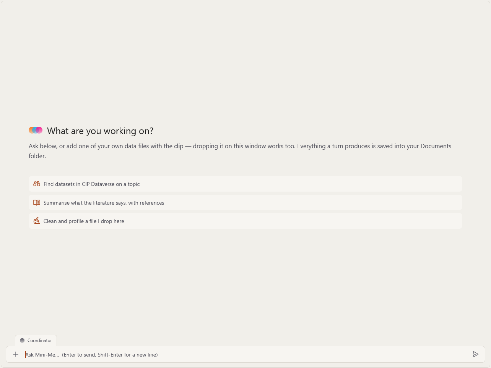
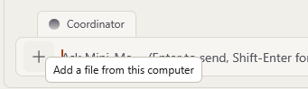
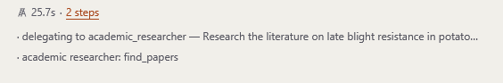
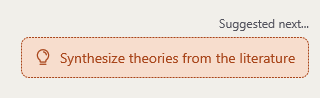
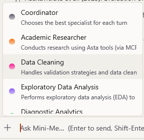

# Asking questions

## Your first question

1. Click in the box at the bottom of the window, where it says **What are you working on?**
2. Type your question in normal words, as you would to a colleague.
3. Press **Enter** (or click the paper-plane button ➤).

Mini-Me starts working. You will see its answer appear bit by bit.

::: {.callout-tip title="Not sure what to ask?"}
A new conversation shows a few **ready-made examples**, such as:

- *Summarise what the literature says, with references*
- *Find datasets in CIP Dataverse on a topic*
- *Clean and profile a file I drop here*

Click one, finish the sentence with your own topic, and press **Enter**.
:::

## Tips for good questions

- **Be specific.** *"What does the literature say about late blight resistance in potato
  varieties grown in the Andes?"* works better than *"Tell me about potatoes."*
- **Say what you want back.** For example: *"…with references"*, *"…as a table"*,
  *"…and make a chart"*.
- **One step at a time.** You can always ask a follow-up question. Mini-Me remembers everything
  said earlier in the same conversation.
- **Ask for a plan first** if the task is big: *"Make a plan to study…"*. You can review the
  plan before anything is done.

## Example questions

| You want to… | Try asking… |
|---|---|
| Review the literature | *Summarise recent research on drought tolerance in sweet potato, with references.* |
| Find datasets | *Search CIP Dataverse for datasets about potato yield trials in Peru.* |
| Check a data file | *Clean and profile the file I attached and tell me what is in it.* |
| Explore data | *Show me the main patterns in this data, with charts.* |
| Explain a result | *Why might yield be lower in the 2022 trials? Check for confounders.* |
| Predict | *Build a model that predicts yield from the weather columns and tell me how good it is.* |
| Get ideas | *Suggest hypotheses about why this variety performs better at altitude.* |
| Write it up | *Write a report of everything we found, with references.* |

## Adding your own files

You can give Mini-Me your own files — for example an **Excel/CSV data file** or **PDF papers**.

1. Click the **Plus** button next to the question box.
2. Choose one or more files from your computer.
3. The files appear as small tiles above the box. Now type your question and press **Enter**.

::: {.callout-note}
Mini-Me works on a **copy** of your file. Your original file is never changed.
:::

::: {.callout-warning}
Do **not** attach confidential or personal data, or unpublished research you are not allowed to
share. See [Please keep in mind](index.qmd).
:::

## While Mini-Me is working

- The answer appears **as it is written**.
- Under the answer you can see **which specialist** answered and a number of **steps**. Click
  the steps to see what each specialist did.
- The [Pinboard](results.qmd) on the right fills up with the plan, files and sources.
- To **stop** an answer, click the red **stop** button (where the send button usually is).
  The answer so far stays on screen, marked as incomplete.

Some tasks may pause and **ask for your permission** before running something on your
computer or spending credits. See [Approvals and credits](approvals.qmd).

## Suggested next steps

At the end of an answer, Mini-Me may show **suggestions** for what to do next. Click one to
put it in the question box, then press **Enter** to run it (or edit it first).

## Choosing a specialist yourself

Usually you don't need to: the **Coordinator** "chooses the best specialist for each turn".
But if you know exactly who you want — for example, the **Report Writer** — you can pick them:

1. Point at the name shown just **above the question box** (it says **Coordinator** by
   default).
2. A list of specialists appears. Click the one you want.
3. Your next question goes straight to that specialist.

See [Meet the specialists](specialists.qmd) for what each one does.

## Copying text

- Select text in the chat with the mouse and press **`Ctrl+C`**.
- **Right-click** in the chat for **Copy**, **Select all** and **Copy last answer**.
- **`Ctrl+Shift+A`** selects the whole conversation.
