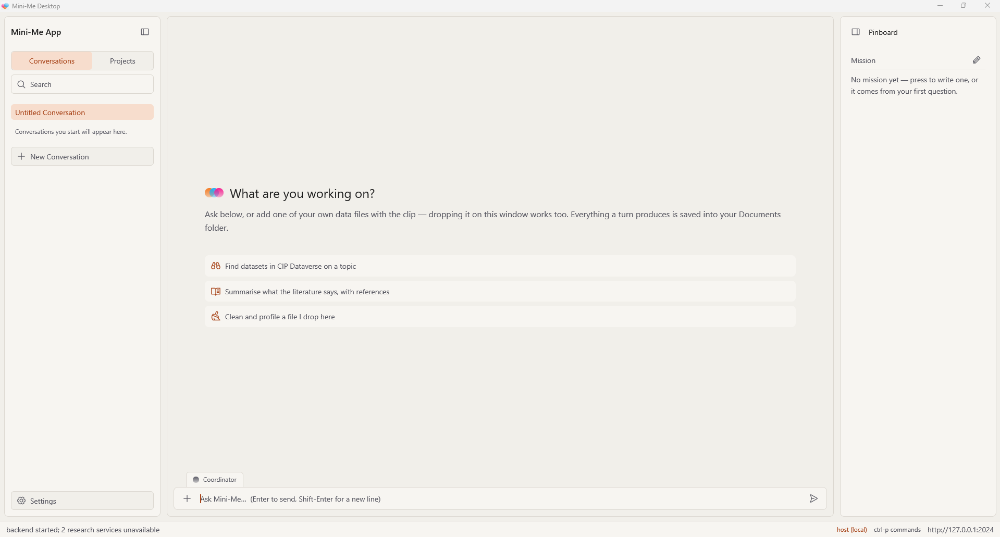

# Bienvenida {.unnumbered}

{fig-alt="La ventana de Mini-Me Desktop"}

## ¿Qué es Mini-Me?

**Mini-Me** es un asistente de investigación que funciona en tu computadora con Windows. Le
hablas igual que le escribirías un mensaje a un colega, y hace el trabajo de investigación por
ti:

- **Encuentra artículos científicos** sobre un tema y resume lo que dicen, con referencias.
- **Encuentra conjuntos de datos** en el CIP Dataverse.
- **Lee tus propios PDF** y te permite buscar en ellos por significado, no solo por palabras.
- **Revisa y limpia tus archivos de datos** (por ejemplo, un archivo Excel o CSV).
- **Analiza tus datos**: patrones, gráficos, estadísticas y predicciones.
- **Propone y pone a prueba ideas** (hipótesis) a partir de la literatura.
- **Escribe un informe** con referencias, que puedes guardar como PDF.

Detrás de escena, Mini-Me tiene un equipo de **especialistas**, cada uno bueno en una sola
tarea. No necesitas saber a cuál preguntarle: un **coordinador** lee tu pregunta y se la pasa
al especialista adecuado.

## ¿Para quién es este manual?

Para todas las personas. **No** necesitas saber programar, usar una terminal ni instalar
programas a mano. Si sabes usar el correo electrónico y un navegador web, puedes usar Mini-Me.

## Cómo leer este manual

Mini-Me ya debería estar instalado y configurado en tu computadora. Si es tu primera vez, lee
estos capítulos en orden:

1. [Recorrido por la ventana](the-window.es.qmd): para qué sirve cada parte de la pantalla.
2. [Hacer preguntas](asking-questions.es.qmd): cómo obtener tu primera respuesta.

Después, consulta los demás capítulos cuando los necesites.

::: {.callout-note title="La aplicación está en inglés"}
Por ahora, Mini-Me se muestra en inglés. En este manual, los nombres de botones y menús
aparecen **en negrita y en inglés**, tal como los verás en pantalla (por ejemplo, **Save**).
:::

::: {.callout-tip title="Abrir este manual desde Mini-Me"}
Puedes abrir este manual en cualquier momento desde la aplicación: ve a **Settings → Help →
Manual de usuario**.
:::

::: {.callout-important title="Ten en cuenta"}
Mini-Me usa **inteligencia artificial generativa**. Es un asistente útil, pero puede
equivocarse.

- **Verifica los resultados** con una persona experta en el tema antes de confiar en ellos.
- **Verifica cada referencia** antes de citarla en tu propio trabajo.
- **No ingreses datos confidenciales ni personales**, investigaciones no publicadas ni
  propiedad intelectual de terceros.
- **Indica que usaste IA** cuando compartas o publiques trabajo hecho con Mini-Me.
:::
