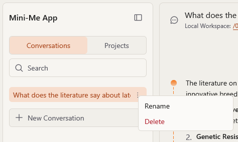
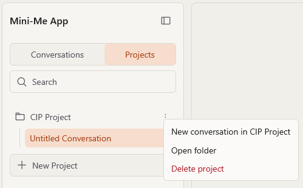
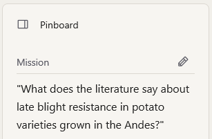
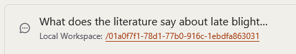

# Proyectos y conversaciones

## Conversaciones

Una **conversación** es un chat con Mini-Me. Todo lo que contiene (tus preguntas, las
respuestas, tus archivos y los resultados) se mantiene junto, y Mini-Me recuerda lo que se dijo
antes cuando haces preguntas de seguimiento.

**Para iniciar una conversación nueva:** haz clic en el botón **+** en la parte superior de la
barra lateral izquierda y elige **New conversation**.

**Para volver a una anterior:** haz clic en ella en la pestaña **Conversations**, o escribe
algunas palabras en el cuadro de búsqueda para encontrarla.

**Para cambiar el nombre de una conversación o eliminarla:** pasa el puntero sobre ella en la
barra lateral, haz clic en el menú **⋮** que aparece a su lado y elige **Rename** (cambiar
nombre) o **Delete** (eliminar).



::: {.callout-warning}
**Eliminar no se puede deshacer.** Se borra la conversación, su historial de chat y todos los
archivos que produjo.
:::

## Proyectos

Un **proyecto** agrupa varias conversaciones sobre un mismo tema; por ejemplo, *"Estudio de
sequía en camote"*. Todas las conversaciones de un proyecto comparten la **misión** y la lista
de avance del proyecto, y sus archivos se guardan juntos en una carpeta.

**Para crear un proyecto:** haz clic en **+** en la parte superior de la barra lateral →
**New project…**, y escribe un nombre.

**Para poner una conversación en un proyecto:** abre la conversación, presiona **`Ctrl+P`**,
elige **Put this conversation in a project** y selecciona el proyecto.

**Para iniciar una conversación nueva dentro de un proyecto:** en la pestaña **Projects**, abre
el menú **⋮** del proyecto y elige **New conversation in *nombre del proyecto***.

**Otras opciones** del menú **⋮** del proyecto:

- **Open folder**: abre la carpeta del proyecto en el Explorador de archivos de Windows.
- **Delete project**: elimina para siempre el proyecto, *todas* sus conversaciones y toda su
  carpeta (incluidos los archivos que hayas puesto allí tú mismo). No se puede deshacer.



## La misión

En la parte superior del [Pinboard](results.es.qmd) está la **Mission** (misión): una o dos
frases que dicen de qué trata el proyecto. Mini-Me la lee **cada vez** que preguntas algo, así
que una misión clara da mejores respuestas.

- Si no escribes una, Mini-Me la toma de tu **primera pregunta**.
- **Para cambiarla:** haz clic en el texto de la misión (o en el lápiz ✏️ junto a *Mission*),
  escribe el texto nuevo y presiona **Enter** para guardar. Presiona **Esc** para cancelar.



Debajo de la misión verás **Completed** (✓, trabajo ya hecho) y **Pending** (○, trabajo por
hacer), que Mini-Me mantiene al día a medida que avanzas.

## Dónde se guardan tus archivos {#where-your-files-are-saved}

Todo lo que Mini-Me crea se guarda como archivos normales en tu carpeta **Documentos**:

```
Documents\Mini-Me\
```

Cada conversación tiene allí su propia carpeta (dentro de la carpeta de su proyecto, si
pertenece a uno). Para abrir la carpeta de la conversación actual, haz clic en el enlace
**Local Workspace** cerca de la parte superior del chat. Puedes abrir estos archivos con tus
programas habituales (Excel, Word, un lector de PDF…), copiarlos o respaldarlos como cualquier
otro archivo.


