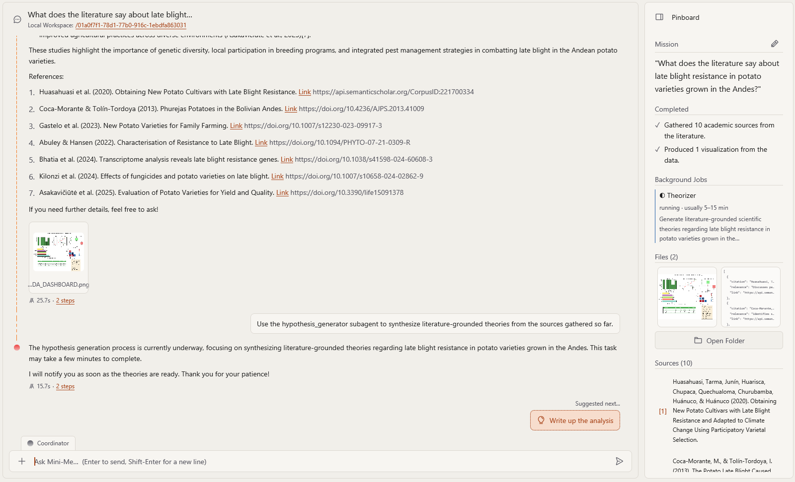
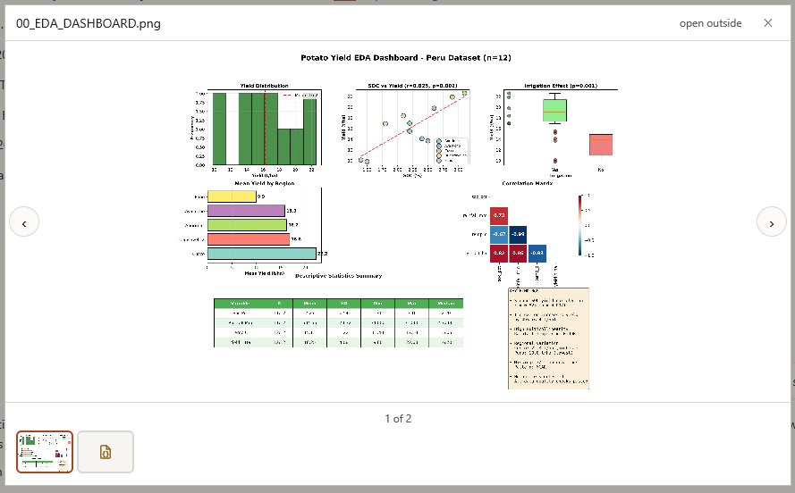
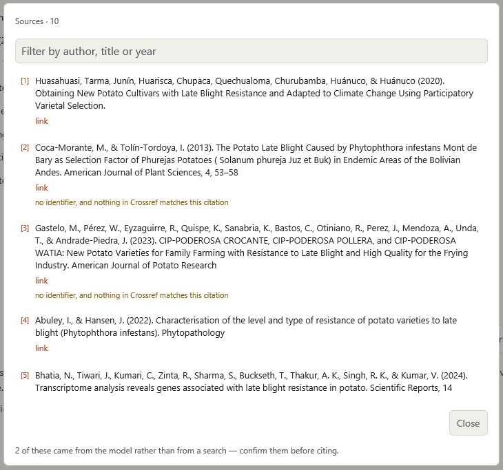
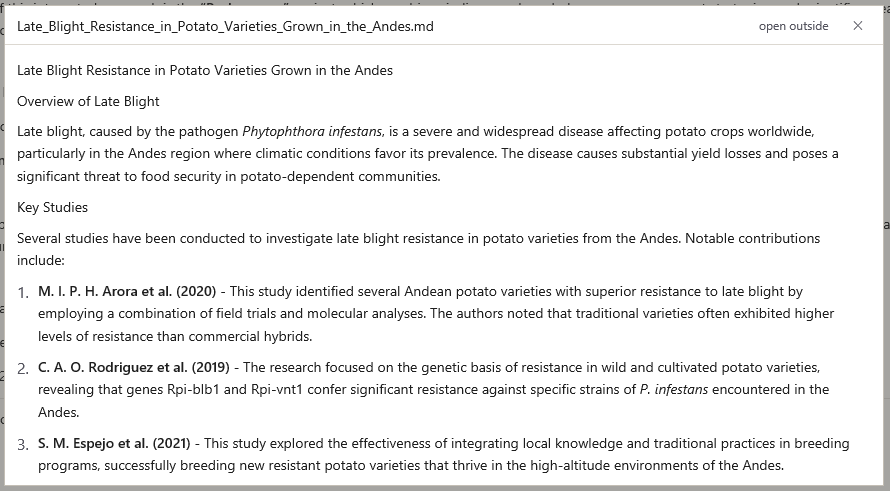
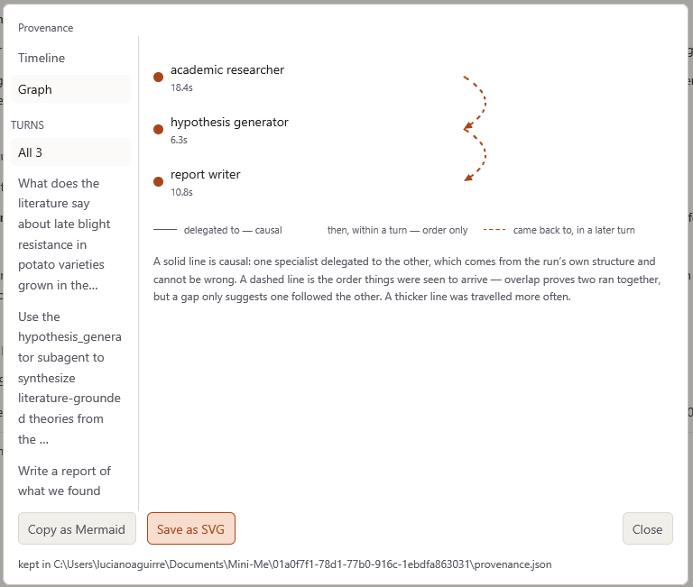

# Tus resultados

Todo lo que Mini-Me produce en una conversación se reúne en el **Pinboard**, el panel del lado
derecho de la ventana. Este capítulo explica cada una de sus partes.

## Plan

Para preguntas más grandes, Mini-Me escribe una breve **lista de verificación** de lo que va a
hacer. El paso en el que está trabajando aparece resaltado, los pasos terminados se atenúan y
los que faltan se listan debajo. El plan se mantiene después de terminar la respuesta, para que
veas qué se hizo.

## Background Jobs

Algunas tareas tardan varios minutos (por ejemplo, generar hipótesis o analizar un conjunto de
datos grande). Aparecen en **Background Jobs** (tareas en segundo plano) mientras se ejecutan,
así que puedes seguir haciendo otras preguntas mientras tanto.

- Una tarea que dice **waiting for your approval** o **waiting for your input** te necesita:
  haz clic en ella y responde. Consulta [Aprobaciones y créditos](approvals.es.qmd).
- Si una tarea termina mientras estás en otra conversación, un mensaje te avisa que **finished
  while you were away** (terminó mientras no estabas). Haz clic en **open it** para ver los
  resultados.

## Files

La sección **Files** (archivos) muestra todo lo guardado en la carpeta de esta conversación:
gráficos, datos limpios, tablas, cuadernos, informes y los archivos que adjuntaste.

- **Haz clic en un archivo** para verlo dentro de Mini-Me. Los gráficos e imágenes se abren a
  tamaño completo; usa las flechas para pasar de uno a otro.
- Elige **open outside** para abrir el archivo en su programa habitual (por ejemplo, Excel).
- Para ver todos los archivos en el Explorador de archivos de Windows, abre la carpeta de la
  conversación (consulta
  [Dónde se guardan tus archivos](projects.es.qmd#where-your-files-are-saved)).

::: {.callout-tip title="¿Archivos guardados en el lugar equivocado?"}
A veces una tarea guarda un archivo fuera de la carpeta de la conversación. Cuando eso pasa,
Mini-Me ofrece un botón como **Copy 2 files into this conversation** para que no se pierda
nada.
:::

## Sources

**Sources** (fuentes) lista los artículos y referencias usados en las respuestas. Haz clic en
una fuente para abrirla en tu navegador. Cuando hay muchas, haz clic en **View More** para ver
la lista completa.

::: {.callout-warning title="Verifica siempre las referencias"}
La mayoría de las referencias provienen de una búsqueda real, pero algunas pueden haber sido
escritas de memoria por la IA. La lista de Sources te indica cuántas **"came from the model
rather than from a search"** (vinieron del modelo y no de una búsqueda): revísalas con cuidado
antes de citarlas.
:::

## Conjuntos de datos

Cuando el **Dataverse Explorer** encuentra conjuntos de datos, los lista en su respuesta con su
título, una breve descripción y un enlace a su página en el CIP Dataverse. Haz clic en un
enlace para abrir la página del conjunto de datos en tu navegador.

Para trabajar con un conjunto de datos, pídelo; por ejemplo, *"Descarga el segundo conjunto de
datos y perfílalo"*. Solo se pueden descargar los conjuntos de datos **públicos**; para los
restringidos, usa la página del conjunto de datos para solicitar acceso al CIP.

## Tus PDF

Cuando le das archivos PDF a Mini-Me, el **PDF Librarian** los lee y los guarda en la
biblioteca de esta conversación. Los PDF mismos aparecen en **Files**.

Para buscar dentro de tus PDF, simplemente pregunta; por ejemplo, *"¿Cuáles de mis PDF hablan
de daños por heladas?"*. Mini-Me busca **por significado**, así que encuentra pasajes
relevantes aunque no usen tus palabras exactas.

## Informes

Pide *"Escribe un informe de lo que encontramos"* y el **Report Writer** crea un informe
completo con métodos, hallazgos, limitaciones y referencias. Aparece en **Files**.

**Para guardar el informe como PDF:** presiona **`Ctrl+P`** y elige **Save the latest report
as a PDF**. El PDF se guarda en la carpeta de la conversación.

## ¿Cómo se hizo esto? (procedencia)

Para ver **qué especialistas trabajaron en esta conversación y en qué orden**, presiona
**`Ctrl+P`** y elige **Show this conversation's provenance**.

Puedes verlo como una **línea de tiempo** (qué pasó, paso a paso) o como un **grafo** (quién le
pasó trabajo a quién). Usa **Save as SVG** para guardar una imagen; por ejemplo, para una
sección de métodos.

