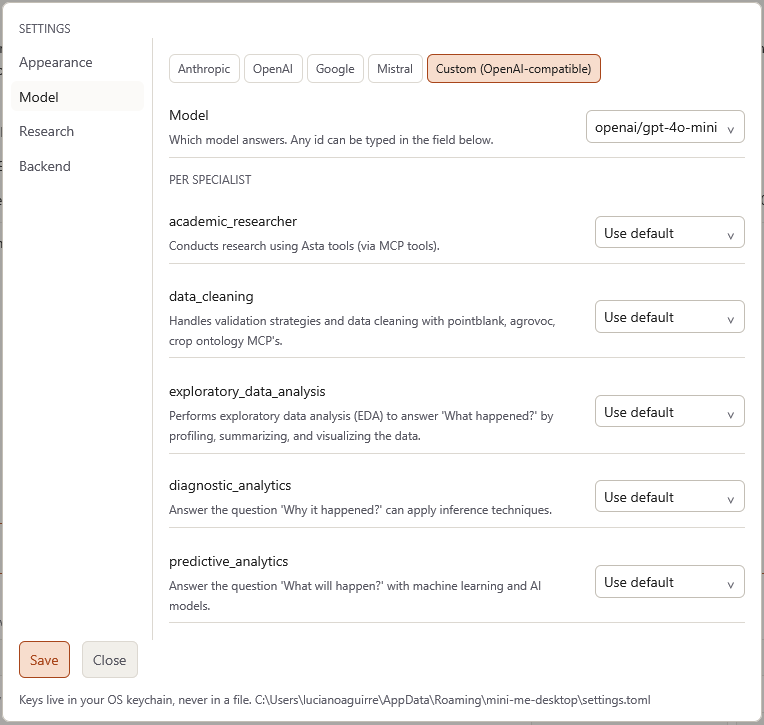
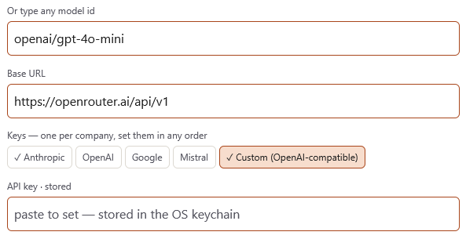

# Settings

Open Settings by pressing **`Ctrl+,`** (Ctrl and comma), or press `Ctrl+P` and choose
**Settings**.

Settings has five pages, listed on the left: **Appearance**, **Model**, **Research**,
**Backend** and **About**. Click a page to open it. To find a setting quickly, type in the
**Search** box above the list — for example *key* shows **Model**, and *port* shows **Backend**.

After making changes, click **Save** at the bottom left. It saves the changes on every page at
once. Click **Close** to leave without saving.

## Appearance

**Theme** changes the colours of the whole window (for example light or dark). Open the list
and **point at a theme to preview it**; click it to choose it, then click **Save**.

Under **GET MORE** you can browse and **install** extra themes.

## Model {#model}

This page controls **which AI** answers your questions, and its keys.

- **Provider** — the AI company: Anthropic, OpenAI, Google, Mistral, or *Custom
  (OpenAI-compatible)*.
- **Model** — which of that company's models to use. Pick one from the list, or type its name
  in the box below if it is newer than the list.
- **Per specialist** — you can give individual specialists a different model. Leave them on
  **Use default** unless you have a reason to change them.
- **Keys** — one API key per company. Click the company's name, paste the key in the
  **API key** box, and click **Save**. A tick (✓) shows which companies already have a key.
  The box shows **· stored** when a key is saved and **· not set** when it isn't. When a key
  is already saved, the empty **API key** box shows a row of asterisks (`********`). Pasting a
  new key and clicking **Save** replaces it.
- **Base URL** — only for *Custom* providers. Your IT team will give you this if you need it.

::: {.callout-note}
Keys are stored in **Windows Credential Manager**, never in a normal file, and are never shown
again after you save them. Using a company's model is **billed to that company's account** —
the one the key belongs to.
:::

## Research

Here you can paste an **Asta token** and an **Asta API key** by hand. Most people don't need
this: signing in to Asta during setup is enough.

## Backend

| Setting | What it does | Recommended |
|---|---|---|
| **Ask before every command** | Pauses and shows each program before it runs on your computer. See [Approvals](approvals.qmd). | On |
| **Let work run in the background** | Long jobs keep going while you carry on asking questions. | Your choice |
| **Show what ran** | Adds a line to the Pinboard listing the programs this conversation ran, and whether any of them saved files outside its folder. Useful when checking your work. | Off, unless you need it |
| **Run setup checks** | Opens the **Get Started** window, which checks your computer and fixes problems. | — |
| **Backend port** | A technical setting. Leave it as it is unless IT asks you to change it. | `2024` |

## About

This page says what Mini-Me is, which version you have, where its data comes from and how to
cite it.

**Version** shows which version of Mini-Me you have, for example
*Mini-Me Desktop 0.3.40 (1c2e866)*. Include it when you report a problem.

Click **Open user manual** to open this manual in your web browser. To read it in Spanish,
click **Español** (with the translate icon) at the top of the manual's sidebar. The manual
comes with the app, so it works without an internet connection and always matches the version you have
installed.

**WHERE THE DATA COMES FROM** lists the services Mini-Me searches: Asta, CIP Dataverse,
AGROVOC and Crop Ontology. For what each one is used for, see
[Where the data comes from](specialists.qmd#data-sources).

**CITING THIS WORK** gives the AstaBench reference to cite if your work uses literature search
results. Drag over it and press `Ctrl+C` to copy it.

You can also open this page with `Ctrl+P` → **About Mini-Me**.
