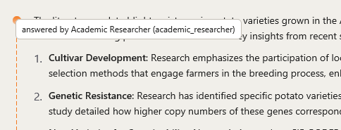

# Conoce a los especialistas

Mini-Me no es un solo asistente, sino un **equipo**. El **Coordinator** (coordinador) lee tu
pregunta y le entrega cada parte del trabajo al especialista adecuado. Cada especialista tiene
su propio color, para que veas de un vistazo quién hizo qué.

No tienes que recordar esta lista: simplemente haz tu pregunta. Está aquí para que sepas qué
puede hacer el equipo.

| Especialista | Qué hace por ti | Pregúntale cosas como… |
|---|---|---|
| **Research Planner** | Escribe un plan breve, paso a paso, para tu investigación. Solo planifica; no hace el trabajo, así que puedes revisarlo primero. | *Haz un plan para estudiar el efecto de la altitud en el rendimiento.* |
| **Academic Researcher** | Busca artículos científicos y resume lo que dicen, con referencias y enlaces. | *¿Qué dice la literatura sobre…?* |
| **Dataverse Explorer** | Busca conjuntos de datos en el CIP Dataverse y te dice cuáles encajan. | *Encuentra conjuntos de datos sobre ensayos de papa en Kenia.* |
| **PDF Librarian** | Lee los PDF que le das y arma una pequeña biblioteca en la que puedes buscar por significado. | *¿Cuáles de mis PDF hablan de la humedad del suelo?* |
| **Data Cleaning** | Revisa tu archivo de datos en busca de problemas (valores faltantes, errores de escritura, nombres raros) y hace una copia limpia. Tu original queda igual. | *Limpia este archivo y dime qué corregiste.* |
| **Exploratory Data Analysis** | Describe tus datos: resúmenes, valores faltantes, valores inusuales y gráficos. | *Muéstrame qué hay en estos datos, con gráficos.* |
| **Diagnostic Analytics** | Investiga *por qué* ocurrió algo, con comparaciones y estadística. | *¿Por qué bajó el rendimiento en 2022?* |
| **Predictive Analytics** | Construye y compara modelos que predicen un resultado, y te dice qué tan confiables son. | *Predice el rendimiento a partir de la lluvia y la temperatura.* |
| **Data Voyager** | Pone a prueba una pregunta concreta con tus datos y devuelve hallazgos y gráficos. | *¿Hay relación entre la fecha de siembra y el rendimiento en este archivo?* |
| **Hypothesis Generator** | Propone ideas y explicaciones nuevas a partir de la literatura. | *Propón hipótesis sobre por qué esta variedad resiste las heladas.* |
| **AutoDiscovery** | Explora un conjunto de datos por su cuenta, proponiendo y probando muchas ideas. **Te pide aprobación** primero porque usa créditos. | *Explora este conjunto de datos y encuentra resultados sorprendentes.* |
| **Report Writer** | Lo reúne todo en un informe completo con métodos, hallazgos, limitaciones y referencias. | *Escribe un informe de lo que encontramos.* |

::: {.callout-note}
Algunos especialistas (Academic Researcher, PDF Librarian, Data Voyager, Hypothesis Generator y
AutoDiscovery) usan el servicio **Asta**, así que necesitas haber iniciado sesión en Asta
durante la configuración. El Dataverse Explorer **no necesita iniciar sesión**: busca
directamente en el CIP Dataverse público.
:::

## De dónde vienen los datos {#data-sources}

Cuando un especialista busca información, usa uno de estos servicios. Saber en cuál se basó una
respuesta te ayuda a evaluarla: la ficha de un conjunto de datos y el resumen de un artículo son
evidencias de distinto tipo.

| Servicio | Qué es | Para qué se usa |
|---|---|---|
| **Asta** | Búsqueda de literatura académica del Allen Institute for AI (Ai2). | Encontrar y resumir artículos, seguir citas. |
| **CIP Dataverse** | El catálogo de conjuntos de datos de investigación del Centro Internacional de la Papa, cada uno con un DOI permanente y su descripción completa. | Encontrar conjuntos de datos. |
| **AGROVOC** | El vocabulario agrícola multilingüe de la FAO. | Unificar los nombres de cultivos, suelos y plagas. |
| **Crop Ontology** | Nombres estándar para rasgos, variedades y mediciones de cultivos. | Hacer comparables los resultados entre estudios. |

Si tu trabajo usa resultados de la búsqueda de literatura, cita AstaBench: la referencia está en
**Settings → About**, en **CITING THIS WORK**.
