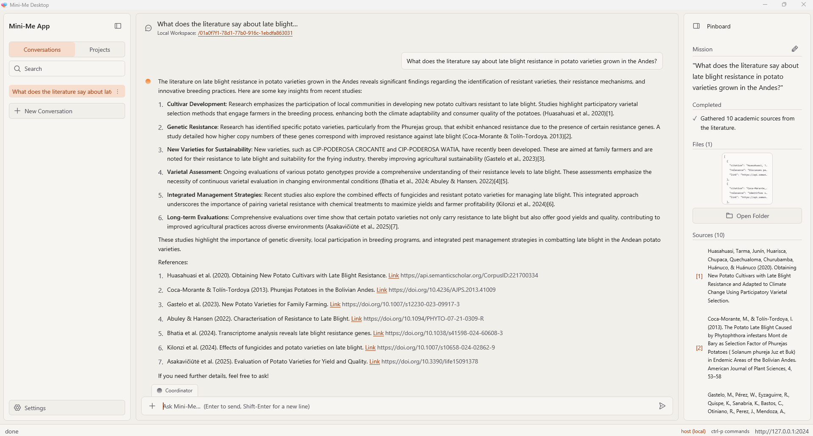
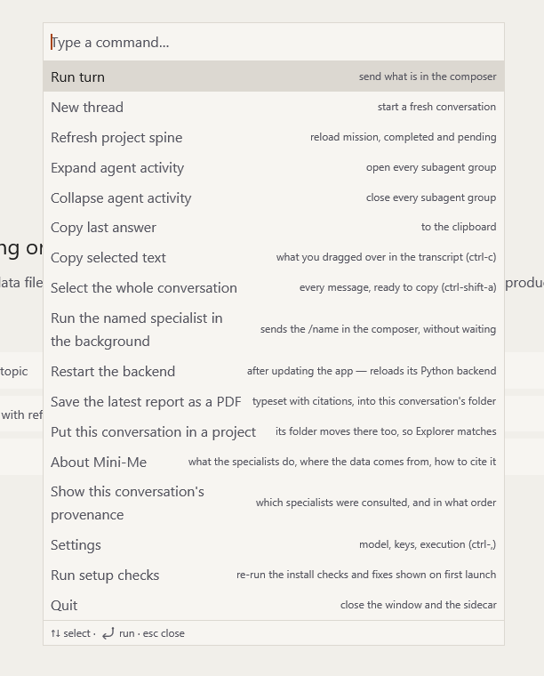

# Recorrido por la ventana

La ventana de Mini-Me tiene **tres áreas principales** y una barra en la parte inferior.

## ① La barra lateral izquierda: tus conversaciones

Aquí encuentras tu trabajo.

- Pestaña **Conversations**: todas las conversaciones que has iniciado, de la más reciente a
  la más antigua.
- Pestaña **Projects**: grupos de conversaciones sobre un mismo tema. Consulta
  [Proyectos y conversaciones](projects.es.qmd).
- **Cuadro de búsqueda**: escribe algunas palabras para encontrar una conversación antigua.
- **Botón +**: inicia una **New conversation** (conversación nueva) o un **New project…**
  (proyecto nuevo).

Puedes ocultar o mostrar la barra lateral con el botón de su parte superior, y hacerla más
ancha o más angosta arrastrando su borde.

## ② El chat: donde hablas con Mini-Me

Esta es el área principal.

- En la **parte inferior** está el cuadro donde escribes tu pregunta. Dentro de él, junto al
  botón de enviar, aparece el nombre del especialista que recibirá tu próxima pregunta
  (**Coordinator**, a menos que elijas otro).
- Encima, las respuestas de Mini-Me aparecen a medida que se escriben, como en un chat.
- Cada respuesta muestra **qué especialista** hizo el trabajo y cuántos **pasos** le tomó. Haz
  clic en los pasos para ver qué ocurrió.

Consulta [Hacer preguntas](asking-questions.es.qmd).

## ③ El Pinboard: tus resultados

El panel de la derecha reúne todo lo que ha producido esta conversación, para que no tengas
que desplazarte por el chat para encontrarlo:

- **Mission**: de qué trata el proyecto.
- **Completed** y **Pending**: el trabajo ya hecho y el que falta por hacer.
- **Plan**: los pasos que sigue Mini-Me para la pregunta actual.
- **Background Jobs**: tareas largas que siguen en ejecución.
- **Files**: gráficos, datos limpios, informes y otros archivos.
- **Sources**: los artículos y referencias que se usaron.

Puedes ocultar o mostrar el Pinboard con el botón de su parte superior. Consulta
[Tus resultados](results.es.qmd).

## ④ La barra inferior

La barra delgada en la parte inferior de la ventana muestra mensajes breves de estado (por
ejemplo, "sign-in link copied"), te recuerda que **`Ctrl+P` abre la lista de comandos** y
muestra el botón de actualización cuando hay una versión nueva lista.

## La lista de comandos (`Ctrl+P`)

Presiona **`Ctrl+P`** en cualquier momento para abrir un cuadro de búsqueda con todo lo que
Mini-Me puede hacer; por ejemplo, *Settings*, *Save the latest report as a PDF* o *Restart the
backend*. Empieza a escribir, usa las flechas para elegir una opción y presiona **Enter**.

Consulta [Atajos de teclado](shortcuts.es.qmd) para ver la lista completa.
