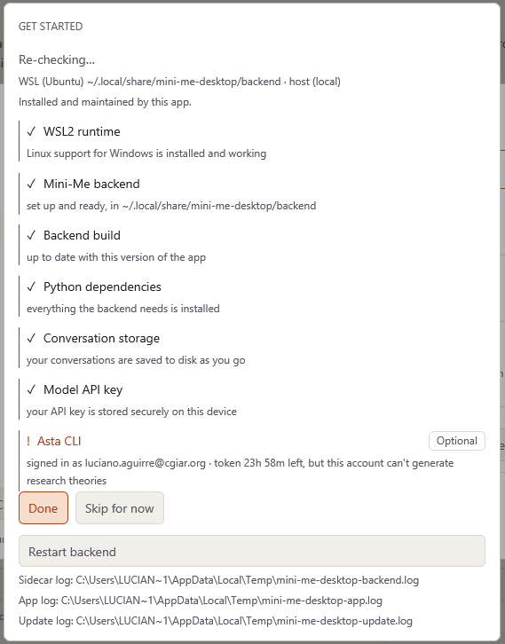

# Troubleshooting

Most problems can be fixed with one of these three steps. Try them in this order:

1. **Run the setup checks again** — `Ctrl+P` → **Run setup checks**, then click
   **Get Started**. It finds and fixes most problems by itself.
2. **Restart the backend** — `Ctrl+P` → **Restart the backend**.
3. **Close Mini-Me and open it again.** If that doesn't help, restart your computer.

## Common problems

### Windows says "Windows protected your PC"

This is normal the first time. Click **More info**, then **Run anyway**.

### The app doesn't open, or doesn't work properly

Check that Mini-Me is installed in the right place:

```
C:\Program Files\mini-me-desktop\mini-me-desktop-app.exe
```

It doesn't work from any other folder (Downloads, Documents, the Desktop…). If yours is
somewhere else, ask the Mini-Me team to install it again. A shortcut on the Desktop is fine;
the app itself must stay in Program Files.

### Mini-Me doesn't answer, or says it can't reach the backend

- Wait a minute — the first start after turning on your computer can be slow.
- Press `Ctrl+P` → **Restart the backend**.
- If that doesn't work, **Run setup checks**.

### "You haven't added an API key"

Mini-Me needs an API key to answer. Add one in **Settings → Model → Keys**
(see [Settings](settings.qmd#model)).

### Literature search or hypothesis generation stopped working

Your **Asta** sign-in expires after a while (about a week). Open **Run setup checks**, find the
**Asta CLI** step and click **Sign in again**.

If it says your account **"can't generate research theories"**, literature search still works,
but you need a different Asta account for hypotheses. Ask your team lead.

### The Dataverse never finds any datasets

You are probably not signed in to the CIP Dataverse. Open **Run setup checks** and click
**Sign in to CIP Dataverse**.

### "Research service unavailable"

One of the online services Mini-Me uses is not responding right now. Everything else keeps
working. Try again later.

### The setup is stuck on installing WSL or Ubuntu

- Look for a **separate black window** — the installation runs there, not inside Mini-Me.
- If Windows asked you to **restart**, do so, then open Mini-Me again.
- If you don't have administrator rights, ask your IT team to run this step with you.

### I can't find a file Mini-Me made

- Look under **Files** in the Pinboard.
- Or open the conversation's folder with the **Local Workspace** link near the top of the chat.
  All files are in `Documents\Mini-Me\`.

### My conversations disappeared after a restart

Open **Run setup checks** and look at **Conversation storage**. If it shows a problem, click
**Save conversations to disk**. (Conversations from before the fix cannot be recovered.)

## Asking for help

If you still have a problem, contact the Mini-Me team:

::: {.callout-note title="Contact"}
Contact someone at the **Digital & Data** team.
:::

To help them help you, include:

1. **What you were doing** and what went wrong (a screenshot helps).
2. **The version of Mini-Me** — it is in **Settings → About → Version**. You can also press
   `Ctrl+P` → **About Mini-Me** to open that page.
3. **The log files** — their locations are listed at the bottom of the **Run setup checks**
   window (*Sidecar log* and *App log*).


